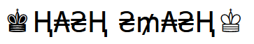
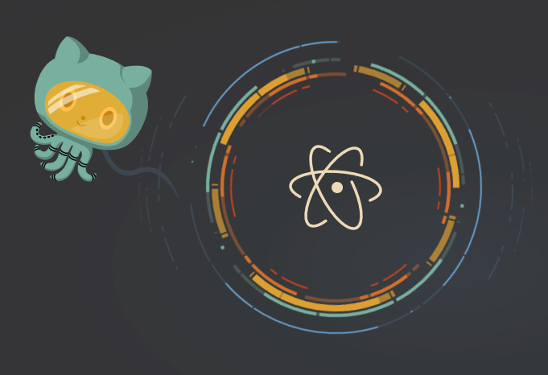
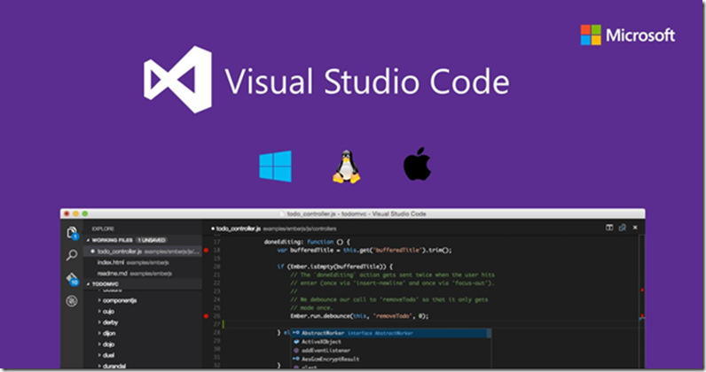
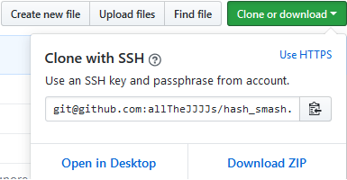

<h1 align="center">
  <br>
  
  <br>
  
  <br>
</h1>

<h4 align="center">Welcome to the Hash Smash API Test Harness!</h4>

<p align="center">
  
  
  
  
</p>

<p align="center">
  <a href="#introduction">Introduction</a> •
  <a href="#features">Features</a> •
  <a href="#setup">Setup</a> •
  <a href="#how-to-use">How to Use</a> •
  <a href="#test-strategy">Test Strategy</a> •
  <a href="#additional-considerations">Additional Considerations</a>
</p>


<h4 align="center">(Click to embiggen)</h4>

## Introduction

This test automation harness was designed to solve the challenges of developing and executing tests against the hash-serve application across the Windows, Linux, and macOs platforms.

The goal for this harness is to handle environment configurations and setup for the user so you can quickly and easily develop your automation tests, with a focus on usability and the user-experience.

If this harness is not true to that vision, then open an [Issue](https://github.com/allTheJJJJs/hash_smash/issues/new) please!

## Features

- Supports development and testing in Windows, Linux, and macOS
- Handles test configuration and execution from a single command
- Containerized Docker Solution (Coming Soon...)
- AWS testing (Coming Soon...)

## Setup

#### Install IDE

Grab an IDE of your choice:

 [Atom](https://atom.io/) 

 [](https://atom.io)
 

 [Visual Studio Code](https://code.visualstudio.com/)
 
 [](https://code.visualstudio.com/)

#### Install Node.js

Next, you'll need to install Node.js.

For `Linux`, use the following commands:
```bash
curl -sL https://deb.nodesource.com/setup_10.x | sudo -E bash -
sudo apt-get install -y nodejs
```
___
For` macOS`, use either:
```bash
curl "https://nodejs.org/dist/latest/node-${VERSION:-$(wget -qO- https://nodejs.org/dist/latest/ | sed -nE 's|.*>node-(.*)\.pkg</a>.*|\1|p')}.pkg" > "$HOME/Downloads/node-latest.pkg" && sudo installer -store -pkg "$HOME/Downloads/node-latest.pkg" -target "/"
```
or the simpler
```bash
brew install node
```
___
For `Windows`, use the Windows Installer from nodejs.org, found [HERE](https://nodejs.org/en/), or `scoop` in `PowerShell`:
```
scoop install nodejs
```
#### Clone the Repo
Now clone or download the repo, like so:

```bash
git clone git@github.com:allTheJJJJs/hash_bash.git
```

Or click on the pretty green download button!



#### Install NPM Modules

Lastly, let's install all the project dependencies! You can install them from the `terminal` or `command line`, like so:
```bash
npm install
```

## How to Use

You will need to assign the `ENVIRONMENT` variable with your current env: windows, linux, or mac.

From your terminal, while inside the project directory, simply type:

```
ENVIRONMENT=<environment> npm test
```

Where `<environment>` can either be `windows`, `linux`, or `mac`.

For Example,
```
ENVIRONMENT=windows npm test
```

That's it! Now go test some stuff!

## Test Strategy

Coming Soon...

## Additional Considerations

Coming Soon...